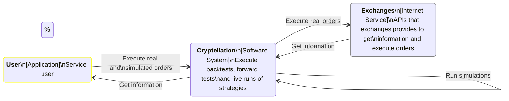
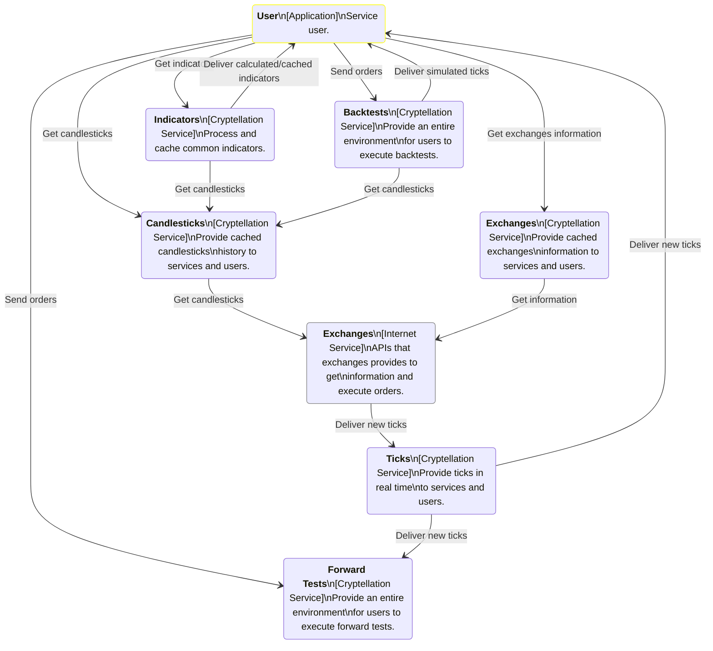

+++
archetype = "chapter"
title = "Services"
weight = 3
+++

On this section, you will find all information to understand what every service
is and how they are interacting with each other.

{}

## System Diagrams

According to the [C4model methodology](https://c4model.com/), you'll find every
diagram to represent how every service is placed in the whole Cryptellation ecosystem. 

### System Context Diagram

This diagram is the first step to understanding the big picture of what's
happening under the hood of the Cryptellation system.

### System Container Diagram

This diagram is the complete overview of every services in the Cryptellation System.

## Other diagrams

For more information on services and more detail diagrams, you should go in each
and every service subdirectory.

