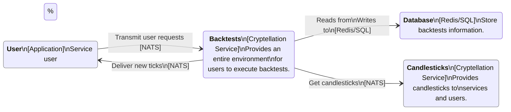

### Container Diagram

This diagram is the overview of the backtests service in the Cryptellation System.

```mermaid
stateDiagram-v2
    direction LR

    % Class definition
    classDef outside stroke:grey

    User: <center><b>User</b>\n[Application]\nService user</center>
    User --> Backtests: Transmit user requests [NATS]

    Candlesticks: <center><b>Candlesticks</b>\n[Cryptellation Service]\nProvides candlesticks to\nservices and users.</center>

    Backtests: <center><b>Backtests</b>\n[Cryptellation Service]\nProvides an entire environment\nfor users to execute backtests.</center>
    Backtests --> Database: Reads from\nWrites to\n[Redis/SQL]
    Backtests --> User: Deliver new ticks\n[NATS]
    Backtests --> Candlesticks: Get candlesticks\n[NATS]

    Database: <center><b>Database</b>\n[Redis/SQL]\nStore backtests information.</center>

    % Class application
    class User outside
    class Candlesticks outside
```

### Component Diagram

This diagram is the internal view of the backtests service:

```mermaid
stateDiagram-v2
    % Class definition
    classDef outside stroke:grey
    classDef adapter stroke:green
    classDef queryCommand stroke:red
    classDef domain stroke:yellow

    User: <center><b>User</b>\n[Application]\nService user</center>
    User --> NATSController: Get request from user [NATS]

    Candlesticks: <center><b>Candlesticks</b>\n[Cryptellation Service]\nProvides candlesticks to\nservices and users.</center>

    Database: <center><b>Database</b>\n[Redis/SQL]\nStore backtests information.</center>

    NATSController: <center><b>NATS Controller</b>\n[Controller]\nReceives NATS request and redirect\nthem to the correct commands/queries.</center>
    NATSController --> GetAccounts: Request accounts
    NATSController --> GetOrders: Request orders
    NATSController --> CreateBacktest: Request backtest creation
    NATSController --> CreateOrder: Request order creation
    NATSController --> SubscribeToEvents: Request subscription
    NATSController --> AdvanceBacktest: Request advance

    GetAccounts: <center><b>Get Accounts</b>\n[Query]\nGet a detailed list of\na backtest accounts.</center>
    GetAccounts --> DatabaseAdapter: Read backtest

    GetOrders: <center><b>Get Orders</b>\n[Query]\nGet a detailed list\nof backtest order.\n</center>
    GetOrders --> DatabaseAdapter: Read backtest

    CreateBacktest: <center><b>Create Backtest</b>\n[Command]\nCreates a backtest with a\nconfiguration provided by the user.</center>
    CreateBacktest --> DatabaseAdapter: Write backtest
    CreateBacktest --> BacktestDomain: Process backtest creation

    BacktestDomain: <center><b>Backtest Domain</b>\n[Domain]\nBusiness Logic related\noperations on backtests.</center>

    CreateOrder: <center><b>Create Order</b>\n[Command]\nCreates a backtest order\nto buy or sell assets.</center>
    CreateOrder --> DatabaseAdapter: Read & write backtest
    CreateOrder --> BacktestDomain: Process order creation

    SubscribeToEvents: <center><b>Subscribe to Events</b>\n[Command]\nSubscribe to some events (prices,\nnews, etc) that will be sent to the\nbacktest message queue.</center>
    SubscribeToEvents --> DatabaseAdapter: Write backtest
    SubscribeToEvents --> BacktestDomain: Process subscription

    AdvanceBacktest: <center><b>Advance Backtest</b>\n[Command]\nAdvance the current time in the\nbacktest. Deliver subscribed events\nhappening between t and t+1.</center>
    AdvanceBacktest --> CandlesticksClient: Request candlesticks
    AdvanceBacktest --> EventBrokerAdapter: Publish new events
    AdvanceBacktest --> DatabaseAdapter: Read & Write backtest
    AdvanceBacktest --> BacktestDomain: Process advancement

    CandlesticksClient: <center><b>Candlesticks Client</b>\n[Adapter]\nAdapter to read candlesticks\nfrom dedicated service.</center>
    CandlesticksClient --> Candlesticks: Request candlesticks\n[NATS]

    EventBrokerAdapter: <center><b>Event Broker Adapter</b>\n[Adapter]\nAdapter for message brokers.
    EventBrokerAdapter --> User: Publish events [NATS]

    DatabaseAdapter: <center><b>Database Adapter</b>\n[Adapter]\nAdapter to read/write DB\nthrough existing libraries and\nfor mocking purposes</center>
    DatabaseAdapter --> Database: Reads from\nWrite to\n[Redis/SQL]

    % Class application
    class Database outside
    class Candlesticks outside
    class User outside
    class NATSController adapter
    class GetAccounts queryCommand
    class GetOrders queryCommand
    class CreateBacktest queryCommand
    class CreateOrder queryCommand
    class SubscribeToEvents queryCommand
    class AdvanceBacktest queryCommand
    class DatabaseAdapter adapter
    class CandlesticksClient adapter
    class EventBrokerAdapter adapter
    class BacktestDomain domain
```
