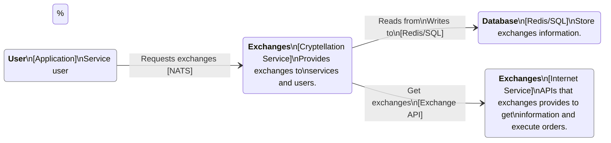
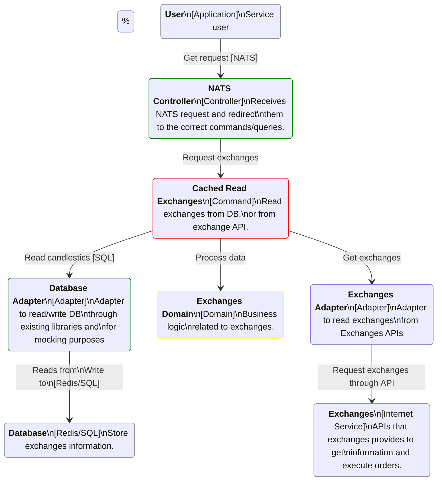

### Container Diagram

This diagram is the overview of the exchanges service in the Cryptellation System.

```mermaid
stateDiagram-v2
    direction LR
    
    % Class definition
    classDef outside stroke:grey

    User: <center><b>User</b>\n[Application]\nService user</center>
    User --> ExchangesService: Requests exchanges [NATS]

    ExchangesService: <center><b>Exchanges</b>\n[Cryptellation Service]\nProvides exchanges to\nservices and users.</center>
    ExchangesService --> Database: Reads from\nWrites to\n[Redis/SQL]
    ExchangesService --> Exchanges: Get exchanges\n[Exchange API]

    Database: <center><b>Database</b>\n[Redis/SQL]\nStore exchanges information.</center>

    Exchanges: <center><b>Exchanges</b>\n[Internet Service]\nAPIs that exchanges provides to get\ninformation and execute orders.</center>

    % Class application
    class User outside
    class Exchanges outside
```

### Component Diagram

This diagram is the internal view of the exchanges service:

```mermaid
stateDiagram-v2
    % Class definition
    classDef outside stroke:grey
    classDef adapter stroke:green
    classDef queryCommand stroke:red
    classDef domain stroke:yellow

    User: <center><b>User</b>\n[Application]\nService user</center>
    User --> NATSController: Get request [NATS]

    Database: <center><b>Database</b>\n[Redis/SQL]\nStore exchanges information.</center>

    NATSController: <center><b>NATS Controller</b>\n[Controller]\nReceives NATS request and redirect\nthem to the correct commands/queries.</center>
    NATSController --> CachedReadExchanges: Request exchanges

    CachedReadExchanges: <center><b>Cached Read Exchanges</b>\n[Command]\nRead exchanges from DB,\nor from exchange API.</center>
    CachedReadExchanges --> DatabaseAdapter: Read candlestics [SQL]
    CachedReadExchanges --> ExchangesDomain: Process data
    CachedReadExchanges --> ExchangesAdapter: Get exchanges

    ExchangesDomain: <center><b>Exchanges Domain</b>\n[Domain]\nBusiness logic\nrelated to exchanges.</center>

    DatabaseAdapter: <center><b>Database Adapter</b>\n[Adapter]\nAdapter to read/write DB\nthrough existing libraries and\nfor mocking purposes</center>
    DatabaseAdapter --> Database: Reads from\nWrite to\n[Redis/SQL]

    ExchangesAdapter: <center><b>Exchanges Adapter</b>\n[Adapter]\nAdapter to read exchanges\nfrom Exchanges APIs</center>
    ExchangesAdapter --> Exchanges: Request exchanges through API

    Exchanges: <center><b>Exchanges</b>\n[Internet Service]\nAPIs that exchanges provides to get\ninformation and execute orders.</center>

    % Class application
    class Database outside
    class User outside
    class Exchanges outside
    class NATSController adapter
    class DatabaseAdapter adapter
    class CachedReadExchanges queryCommand
    class ExchangesDomain domain
```
