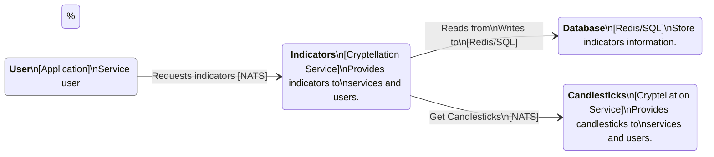
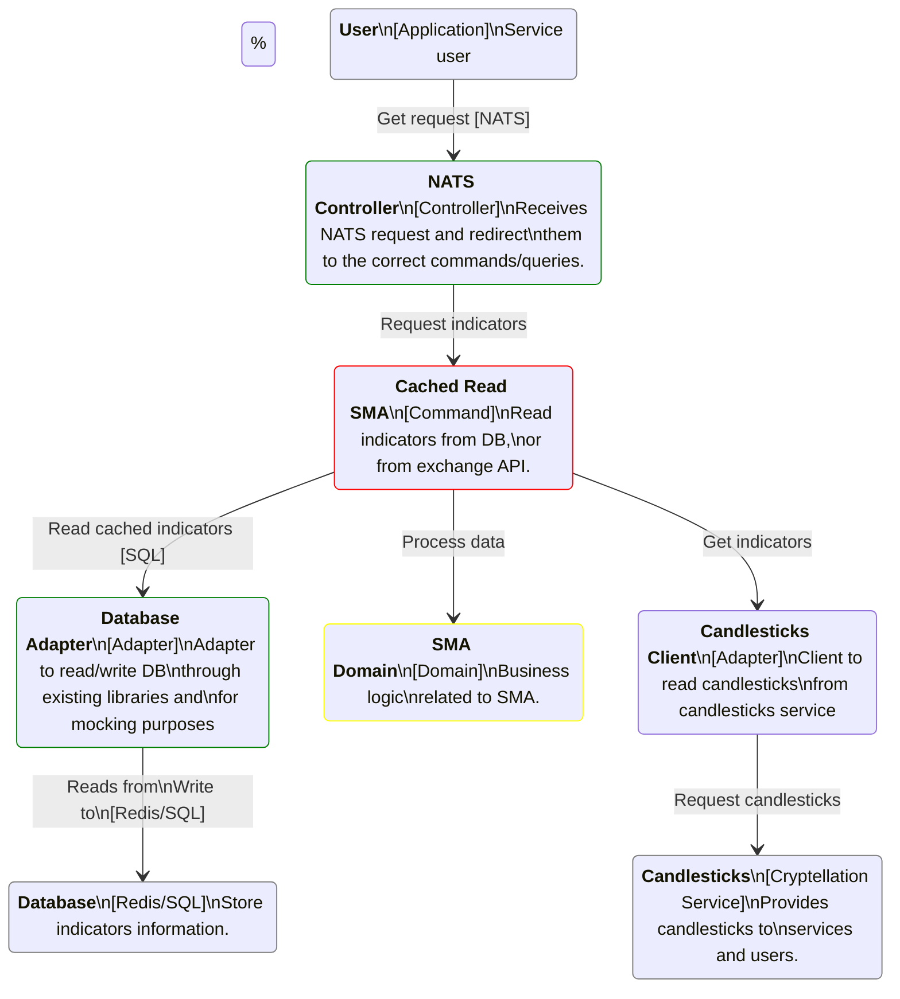

### Container Diagram

This diagram is the overview of the indicators service in the Cryptellation System.

```mermaid
stateDiagram-v2
    direction LR
    
    % Class definition
    classDef outside stroke:grey

    User: <center><b>User</b>\n[Application]\nService user</center>
    User --> IndicatorsService: Requests indicators [NATS]

    IndicatorsService: <center><b>Indicators</b>\n[Cryptellation Service]\nProvides indicators to\nservices and users.</center>
    IndicatorsService --> Database: Reads from\nWrites to\n[Redis/SQL]
    IndicatorsService --> Candlesticks: Get Candlesticks\n[NATS]

    Database: <center><b>Database</b>\n[Redis/SQL]\nStore indicators information.</center>

    Candlesticks: <center><b>Candlesticks</b>\n[Cryptellation Service]\nProvides candlesticks to\nservices and users.</center>

    % Class application
    class User outside
```

### Component Diagram

This diagram is the internal view of the indicators service:

```mermaid
stateDiagram-v2
    % Class definition
    classDef outside stroke:grey
    classDef adapter stroke:green
    classDef queryCommand stroke:red
    classDef domain stroke:yellow

    User: <center><b>User</b>\n[Application]\nService user</center>
    User --> NATSController: Get request [NATS]

    Database: <center><b>Database</b>\n[Redis/SQL]\nStore indicators information.</center>

    NATSController: <center><b>NATS Controller</b>\n[Controller]\nReceives NATS request and redirect\nthem to the correct commands/queries.</center>
    NATSController --> CachedReadSMA: Request indicators

    CachedReadSMA: <center><b>Cached Read SMA</b>\n[Command]\nRead indicators from DB,\nor from exchange API.</center>
    CachedReadSMA --> DatabaseAdapter: Read cached indicators [SQL]
    CachedReadSMA --> SMADomain: Process data
    CachedReadSMA --> CandlesticksClient: Get indicators

    SMADomain: <center><b>SMA Domain</b>\n[Domain]\nBusiness logic\nrelated to SMA.</center>

    DatabaseAdapter: <center><b>Database Adapter</b>\n[Adapter]\nAdapter to read/write DB\nthrough existing libraries and\nfor mocking purposes</center>
    DatabaseAdapter --> Database: Reads from\nWrite to\n[Redis/SQL]

    CandlesticksClient: <center><b>Candlesticks Client</b>\n[Adapter]\nClient to read candlesticks\nfrom candlesticks service</center>
    CandlesticksClient --> Candlesticks: Request candlesticks

    Candlesticks: <center><b>Candlesticks</b>\n[Cryptellation Service]\nProvides candlesticks to\nservices and users.</center>

    % Class application
    class Database outside
    class User outside
    class Candlesticks outside
    class NATSController adapter
    class DatabaseAdapter adapter
    class CachedReadSMA queryCommand
    class SMADomain domain
```
