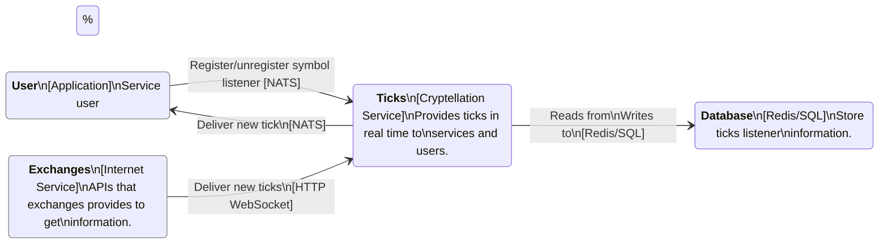
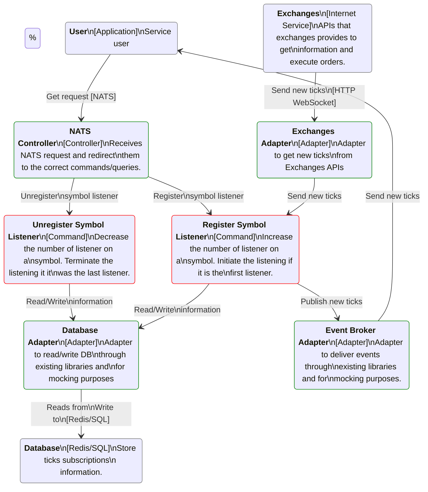

### Container Diagram

This diagram is the overview of the candlesticks service in the Cryptellation System.

### Component Diagram

This diagram is the internal view of the candlesticks service:

